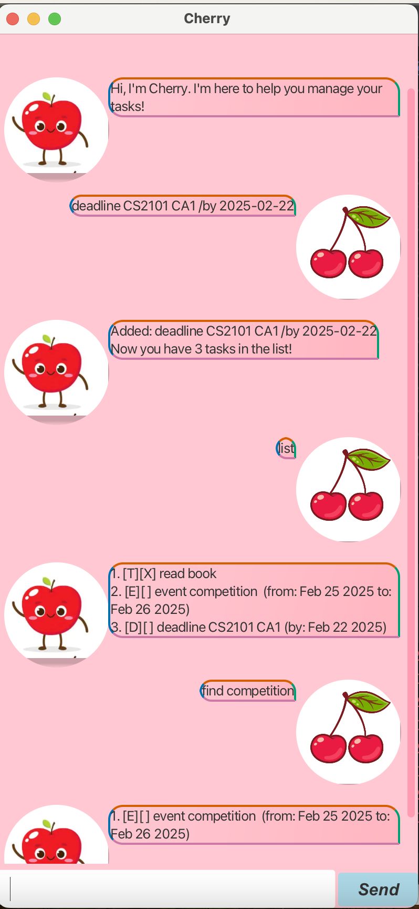

# Cherry User Guide

Cherry is a graphical user interface (GUI) desktop app that helps you manage your upcoming tasks.

## Getting Started

To launch the chat bot, run the following command in the terminal:

```
java -jar cherry.jar
```

This starts the application and displays a welcome message.

## Features

- **Add Tasks**: Easily add new tasks with a simple and intuitive interface.
- **Mark as Finished**: Keep track of your progress by marking tasks as completed.
- **Find Tasks**: Quickly search and filter tasks to find what you need.

## Commands

### Add task

Tasks can be of the 3 categories: todo, deadline, event

Command format:

`todo [task name] /by [end date]`

`deadline [task name] /by [end date]`

`event [task name] /from [start date] /to [end date]`

📌 *Dates must be in the yyyy-mm-dd format.*

After successfully added the task, you will be able to see the following output:

```
Added: [taskname]
Now you have # tasks in the list!
```

### Delete task

This is a complement of adding task command.

`delete [task number]`

After successfully deleting the task, you will be able to see the following output:

```
Okay, I've removed this task from your task list.
```

### Mark/Unmark task

This command allows you to mark a task as done. You may also unmark a task if it was marked wrongly.

Command format:

`mark [task number]`

`unmark [task number]`

After successfully marking/unmarking the task, you will be able to see the following output:

```
Nice! I've marked this task as done.
```

### Find tasks

This command allows you to find specific tasks in your taskList with a certain keyword.

Command format:

`find [keyword]`

After successfully finding the task, you will be able to see the tasks listed.

### List tasks

This command list out all the things currently in your todo list

Command format:

`list`

The tasks will be displayed similar to the following format:

```
1. [T][X] return book
2. [E][] event competition (from: Feb 25 2025 to: Feb 27 2025)
```

## Sample Gui


